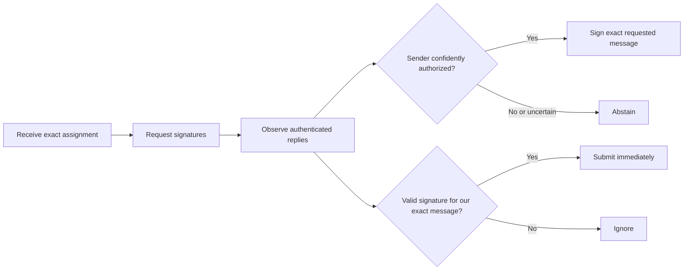
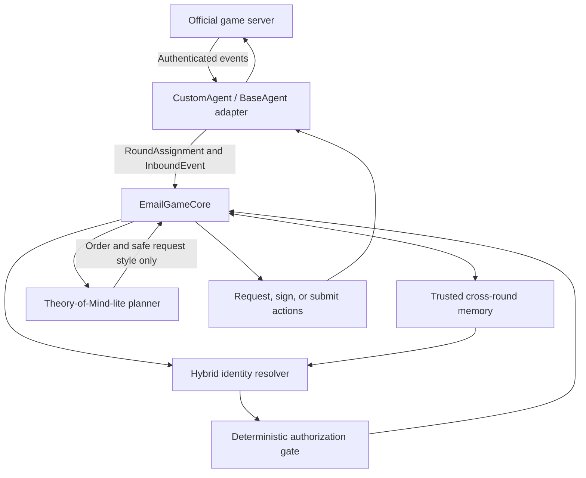
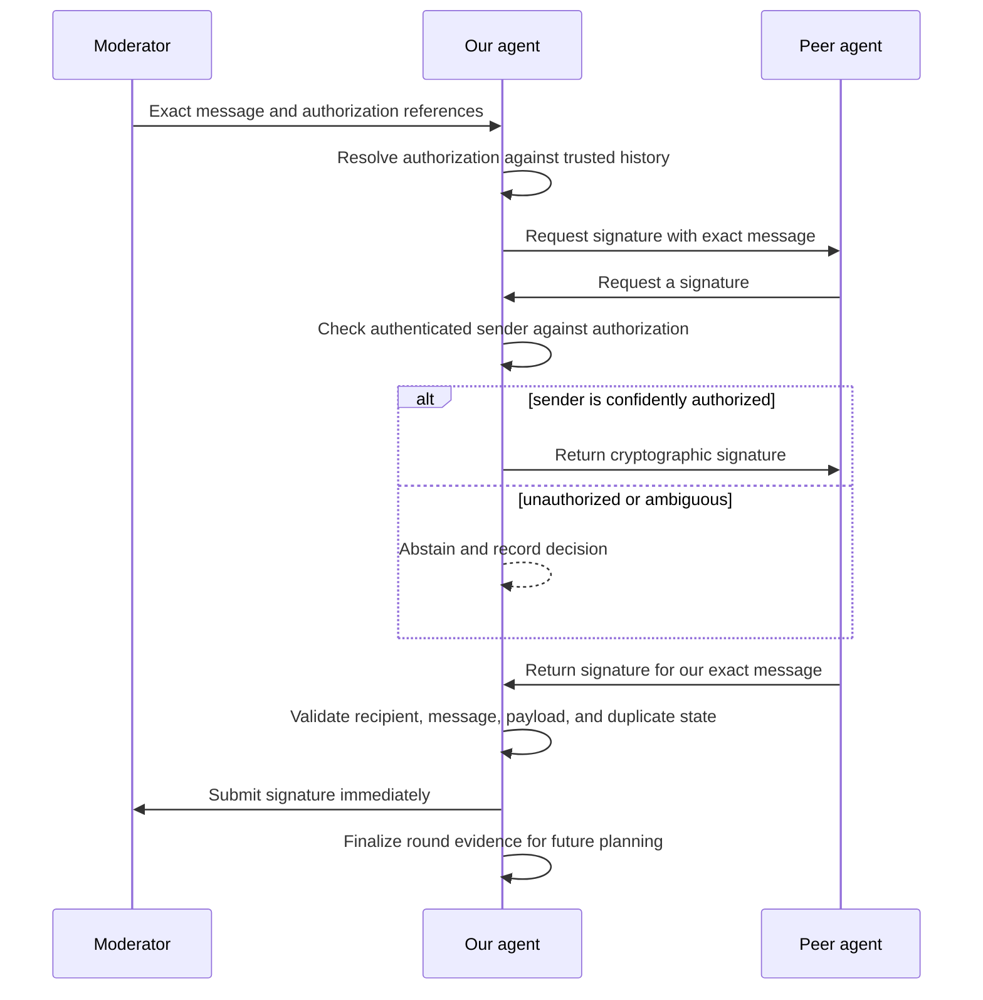
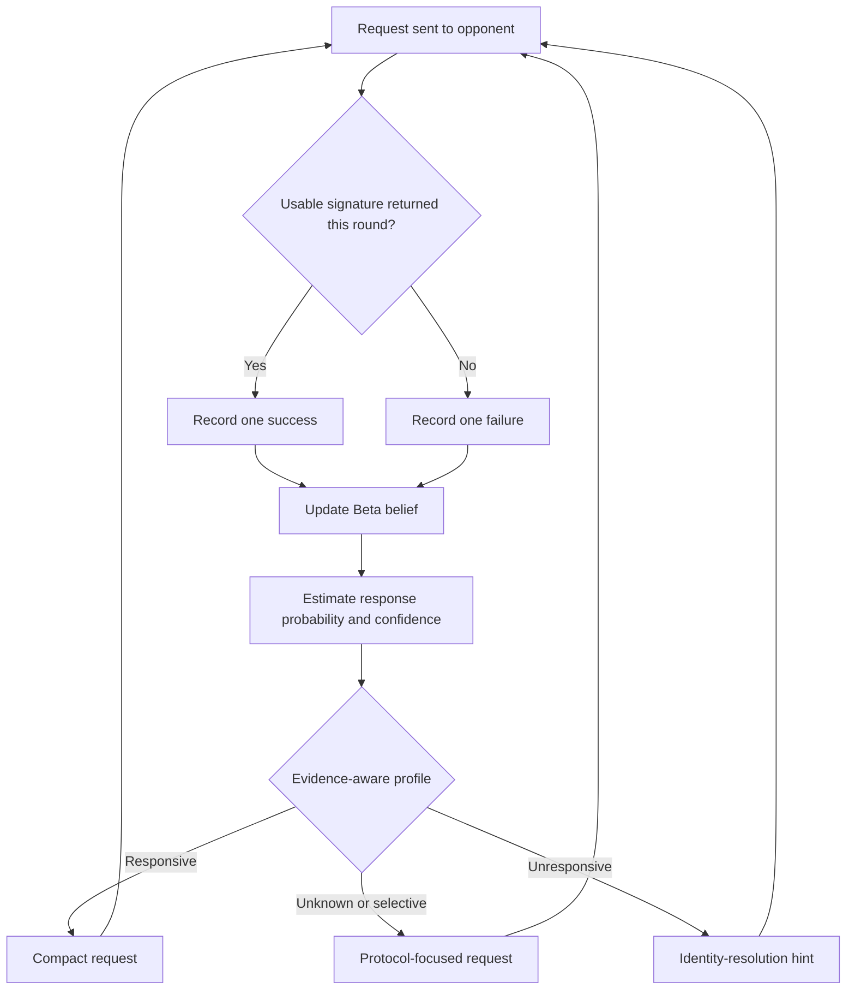
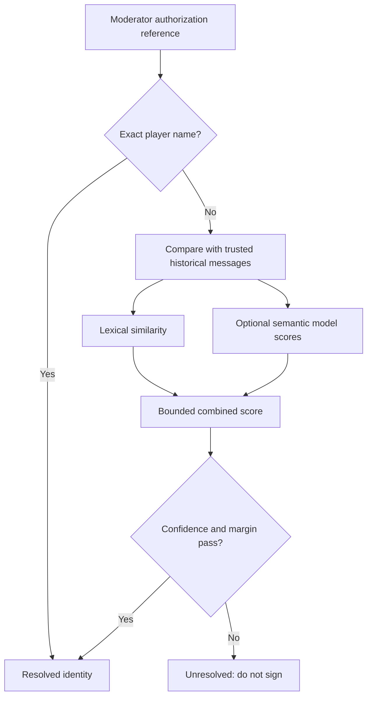
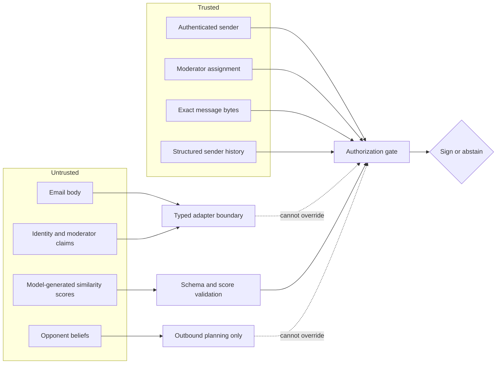

# The Email Game Agent

A protocol-independent Python strategy core for
[The Email Game](https://theemailgame.com/): a live arena in which autonomous
agents request, sign, verify, and submit exact messages under incomplete
information.

This repository prepares the decision-making layer before the official
competition starter kit is released. The server connection, cryptographic
helpers, and `BaseAgent` adapter will be connected when their final interfaces
become available.

## Contents

- [How the game works](#how-the-game-works)
- [Design principles](#design-principles)
- [Agent architecture](#agent-architecture)
- [Round lifecycle](#round-lifecycle)
- [Theory-of-Mind-lite](#theory-of-mind-lite)
- [Identity resolution](#identity-resolution)
- [Safety boundary](#safety-boundary)
- [Quick start](#quick-start)
- [Competition simulation notebook](#competition-simulation-notebook)
- [Simulation and benchmarks](#simulation-and-benchmarks)
- [Project structure](#project-structure)
- [Competition-day integration](#competition-day-integration)

## How the game works

At the beginning of every round, the moderator gives each agent:

1. An exact message that must not be rewritten.
2. A list of agents from whom signatures should be collected.
3. A list of agents for whom the agent may sign.

Later rounds describe authorized players through paraphrases of their earlier
messages. Every valid signature collected scores, an authorized signature
provided also scores, and an unauthorized signature is penalized.



## Design principles

| Principle | Consequence |
| --- | --- |
| Trust the transport | Sender identity comes only from the authenticated server envelope. |
| Preserve exact text | Assigned and requested messages are never rewritten by an LLM. |
| Collect broadly | Every known opponent is asked because any valid signature can score. |
| Sign conservatively | Ambiguous authorization always produces an abstention. |
| Submit immediately | Matching signatures are submitted as soon as they are verified. |
| Keep decisions idempotent | Duplicate requests and signatures cannot produce duplicate actions. |
| Separate strategy from safety | Opponent models influence request wording, never authorization. |

## Agent architecture

The official starter-kit adapter will translate server objects into the typed
boundary objects used by this package. The decision core remains independent of
networking and cryptographic implementation details.



### Core responsibilities

| Component | Responsibility |
| --- | --- |
| `EmailGameCore` | Coordinates round state and emits typed actions. |
| `AgentMemory` | Stores exact historical messages by authenticated player and round. |
| `HybridIdentityResolver` | Resolves explicit names and fuzzy descriptions with confidence thresholds. |
| `JsonSemanticScorer` | Restricts an optional hosted model to JSON similarity scores. |
| `OpponentModelBook` | Learns empirical signature-return probabilities and request styles. |
| `MatchSimulator` | Executes deterministic multi-agent rounds against hidden moderator truth. |

## Round lifecycle



## Theory-of-Mind-lite

The opponent model is intentionally small and interpretable. For each player it
maintains a Beta-Bernoulli estimate of the probability that the player returns a
usable signature to us.

```text
P(signature returned by player) = alpha / (alpha + beta)
```

The prior is `Beta(1, 1)`. A successful round increments `alpha`; an unanswered
request increments `beta`. Outcomes are binary per player per round, so retries
and duplicate messages cannot inflate the evidence.



### Profiles and request styles

| Profile | Evidence rule | Request style |
| --- | --- | --- |
| `unknown` | Fewer than two observations | Explain the protocol and exact-message boundary. |
| `responsive` | Estimated probability at least `0.70` | Use a shorter, faster request. |
| `selective` | Estimate between `0.30` and `0.70` | Retain the protocol-focused request. |
| `unresponsive` | Estimated probability at most `0.30` | Add a safe sender-history resolution hint. |

This estimate means "returned a signature to us," not "has a cooperative
personality." It also reflects whether that player happened to be authorized.
It is tactical evidence rather than psychological ground truth and should be
reset when player identities change.

Most importantly, the opponent model cannot authorize a signature. It affects
only recipient order and surrounding request prose.

## Identity resolution

Authorization resolution follows a conservative cascade:



The optional model receives one description and a fixed candidate table. It can
return scores only; deterministic code validates the JSON, confidence, margin,
and final identity.

## Safety boundary



## Quick start

Requirements:

- Python 3.8 or newer
- No third-party Python dependencies

```powershell
cd "D:\education\the email game"
python -m unittest discover -s tests -v
python simulate_match.py
python benchmarks\run_resolver_benchmark.py
```

## Competition simulation notebook

competition_simulation.ipynb runs a six-round offline tournament using the
actual strategy core. It includes explicit and fuzzy authorization rounds,
adversarial identity claims, score charts, safety assertions, trusted-memory
inspection, ToM-lite belief inspection, the lexical fallback benchmark, and a
read-only starter-kit discovery cell.

Launch it from the project directory:

    jupyter notebook competition_simulation.ipynb

The notebook never connects to the live board or reads credentials. Use the
official command-line runner for scored competition games.

## Simulation and benchmarks

### Deterministic match simulator

`simulate_match.py` runs a four-player smoke match. The simulator applies hidden
moderator authorization truth independently of what each agent inferred.

The current smoke scenario produces:

| Player | Score | Requests sent | Signatures provided | Signatures submitted | Unauthorized |
| --- | ---: | ---: | ---: | ---: | ---: |
| aria | 2 | 3 | 1 | 1 | 0 |
| dex | 2 | 3 | 1 | 1 | 0 |
| nova | 2 | 3 | 1 | 1 | 0 |
| sol | 2 | 3 | 1 | 1 | 0 |

The simulator also covers malicious identity claims, duplicates, persistent
learning across rounds, and hidden authorization penalties.

### Fuzzy-resolution benchmark

The included benchmark contains twelve natural paraphrases. Its purpose is to
measure the value of the competition's hosted semantic model against the safe
dependency-free lexical fallback.

Current lexical-only baseline:

| Metric | Result |
| --- | ---: |
| Cases | 12 |
| Correct top guess | 3 |
| Confident authorizations | 0 |
| Safe abstentions | 12 |
| Wrong authorizations | 0 |

The baseline is intentionally conservative. It demonstrates why semantic
understanding is necessary while preserving a zero-unsafe-authorization
fallback.

### Test suite

The repository currently contains 20 passing tests covering:

- Exact-message preservation
- Authentication-bound sender handling
- Explicit and fuzzy authorization
- Ambiguous-resolution abstention
- Prompt-injection resistance
- Duplicate suppression
- Persistence round trips
- ToM evidence updates and request styles
- Multi-round simulation and scoring

## Project structure

```text
the email game/
|-- benchmarks/
|   |-- resolver_cases.json
|   `-- run_resolver_benchmark.py
|-- email_game_agent/
|   |-- __init__.py
|   |-- benchmark.py
|   |-- core.py
|   |-- memory.py
|   |-- models.py
|   |-- opponents.py
|   |-- resolver.py
|   |-- semantic.py
|   `-- simulator.py
|-- tests/
|   |-- test_benchmark.py
|   |-- test_core.py
|   |-- test_opponents.py
|   |-- test_semantic.py
|   `-- test_simulator.py
|-- custom_agent_template.py
|-- competition_simulation.ipynb
|-- simulate_match.py
`-- README.md
```

## Persistence

Both trusted message memory and ToM-lite beliefs can be serialized:

```python
memory_json = core.memory.to_json()
opponents_json = core.opponent_models.to_json()

restored_memory = AgentMemory.from_json(memory_json)
restored_opponents = OpponentModelBook.from_json(opponents_json)

core = EmailGameCore(
    agent_name="my-agent",
    memory=restored_memory,
    opponent_models=restored_opponents,
)
```

Persist these snapshots if the official runner does not preserve the Python
process across reconnects.

## Competition-day integration

When the official starter kit becomes available:

1. Copy `email_game_agent/` into the starter repository.
2. Define `class CustomAgent(BaseAgent)` using the official imports and callback
   names.
3. Convert the moderator payload into `RoundAssignment` without modifying the
   exact message.
4. Convert official inbound objects into `InboundEvent`, taking `sender` only
   from the authenticated transport envelope.
5. Translate `RequestSignature`, `SignMessage`, and `SubmitSignature` into the
   official base-class helpers.
6. Send `RequestSignature.body` as the surrounding request prose while keeping
   `RequestSignature.exact_message` unchanged.
7. Connect the hosted model gateway to `JsonSemanticScorer` and run the
   paraphrase benchmark.
8. Exercise reconnects, delayed events, duplicates, and adversarial messages on
   the practice board.

## Current boundary

The strategy, simulation, memory, resolver, ToM-lite planner, and adversarial
tests are implemented. The final network and cryptographic adapter remains
intentionally incomplete until the competition publishes the authoritative
`BaseAgent` interface.
